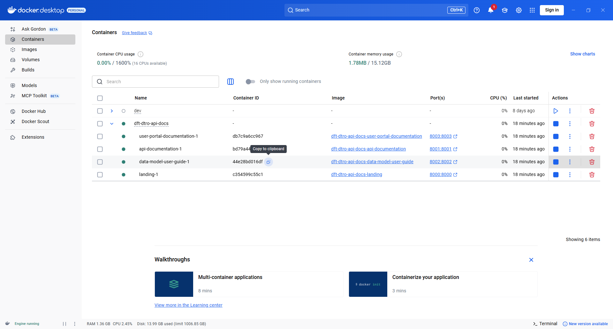
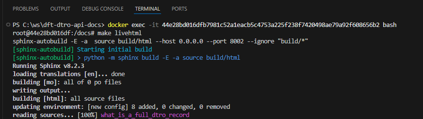
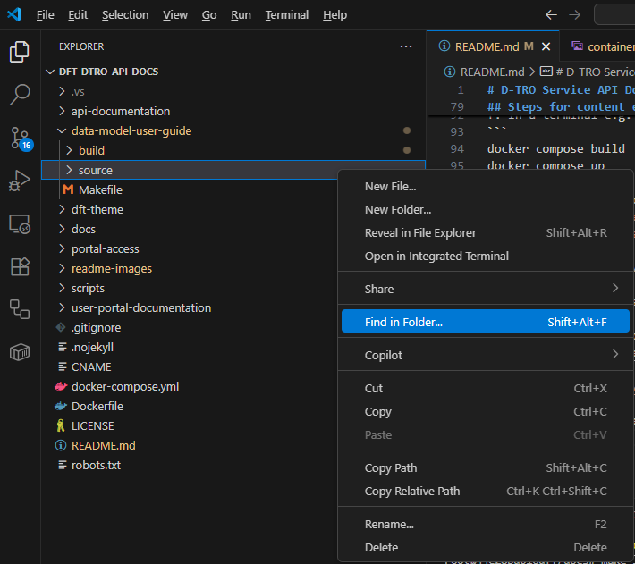
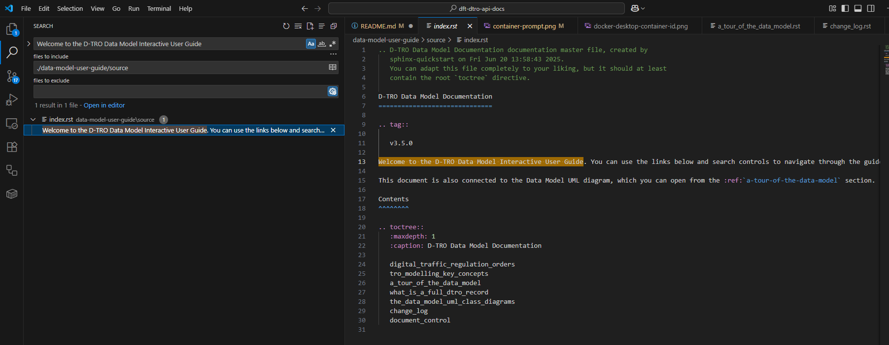
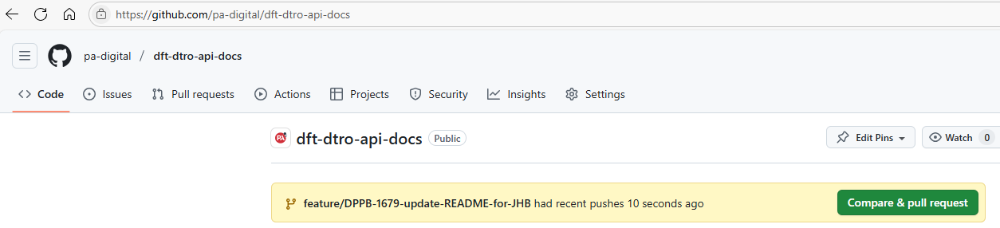
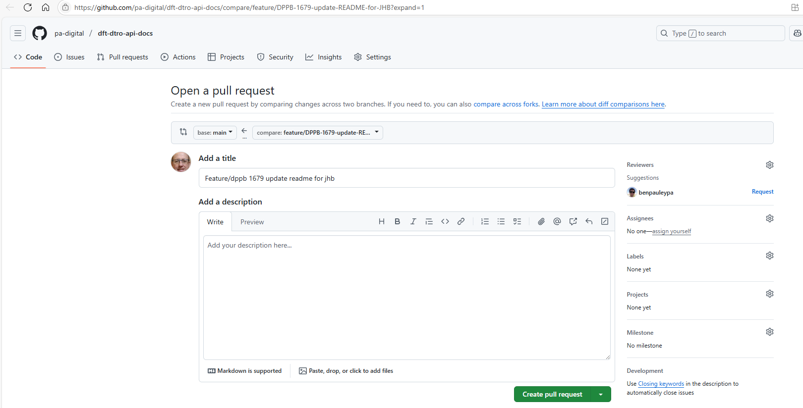
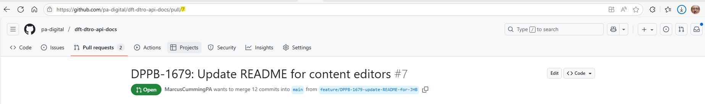
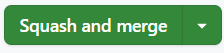
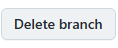

# D-TRO Service API Documentation

This repository contains technical documentation for the D-TRO service. It consists of three sources of documentation:

* **Technical API documentation**, providing a quickstart guide on interfacing with the D-TRO API, as well as Swagger documentation on API usage
* The **Data Model User Guide**, which provides an in-depth look at the D-TRO data model
* The **User Portal Documentation**, which explains how to get started with creating an account and applications to interact with the D-TRO service

The documentation itself is served here: https://d-tro.dft.gov.uk/

This repository also contains the `dft-theme` Sphinx theme, and a landing page that directs users to the necessary documentation.

## Local Development

Developing locally can be achieved with Docker. The `docker-compose.yml` file allows you to run the documentation. The Dockerfile will create containers with `sphinx-autobuild` installed, along with the `dft-theme` and other required packages. `api_documentation` will expose port 8001, `data_model_user_guide` will expose port 8002 and `user_portal_documentation` will expose port 8003.

The containers are set to do nothing when run; this is by design, and allows ytou to exec into them and run whatever you need, e.g. `sphinx-autobuild` for live editing of the documentation, `make html` to build the documentation, etc.

If any changes are made to the underlying `dft-theme`, you will need to rebuild the Docker containers for these changes to take effect.

Steps for running the documentation locally using Docker:

**1. Open the folder with the code repository**

**2. Open a terminal and run `docker compose build`**

**3. Run command `docker compose up`**

**4. Open another terminal and run command `docker ps`**

**5. Depending on what you want to run, copy that docker id. The below table is to be used an example, as your ids might differ than these**

### Docker Containers Table

| CONTAINER ID | IMAGE                                       | COMMAND             | CREATED       | STATUS       | PORTS                                       | NAMES                                         |
|--------------|---------------------------------------------|---------------------|---------------|--------------|---------------------------------------------|-----------------------------------------------|
| fb2770ee2a88 | dft-dtro-api-docs-api-documentation         | "tail -f /dev/null" | 8 minutes ago | Up 8 minutes | 0.0.0.0:8001->8001/tcp, [::]:8001->8001/tcp | dft-dtro-api-docs-api-documentation-1         |
| 90ea783e393d | dft-dtro-api-docs-user-portal-documentation | "tail -f /dev/null" | 8 minutes ago | Up 8 minutes | 0.0.0.0:8003->8003/tcp, [::]:8003->8003/tcp | dft-dtro-api-docs-user-portal-documentation-1 |
| 314d1648f86f | dft-dtro-api-docs-landing                   | "tail -f /dev/null" | 8 minutes ago | Up 8 minutes | 0.0.0.0:8000->8000/tcp, [::]:8000->8000/tcp | dft-dtro-api-docs-landing-1                   |
| 1d22c7cfefca | dft-dtro-api-docs-data-model-user-guide     | "tail -f /dev/null" | 8 minutes ago | Up 8 minutes | 0.0.0.0:8002->8002/tcp, [::]:8002->8002/tcp | dft-dtro-api-docs-data-model-user-guide-1     |

**6. Run command `docker exec -it [CONTAINER ID]¹ bash`**

**7. Inside container run command `make livehtml`**

**8. Open e.g. http://127.0.0.1:8002**

¹ Make sure the port number matches the container id.

## Documentation Building

The helper script `scripts/build.sh` is provided to automate the build process. Note that the Docker containers need to be running for this script to work. This script does the following:

* deletes existing build files
* execs into each Docker container and runs `make html` to generate the build files (in the `api_documentation` project it will also run redoc to generate the interactive API documentation)
* copies the outputs to the `docs` folder

## Documentation Serving

The documentation is served through GitHub Pages, which serves the content of the `docs` folder. Currently this is served form the `main` branch, meaning source and build files exist together. At a future point the build files will be on a separate branch, and GitHub pages will serve the content of this branch, allowing the source and build files to be separated. Github Actions will then build the files from the `main` branch, and commit them to this other branch.

## Steps for content editors making changes to the data model user guide

**1. Initial set-up:**

a. Download and install the appropriate Docker Desktop from https://www.docker.com/products/docker-desktop.

b. Install a Git client, e.g. Git Bash or a Git UI client.

c. Clone this repo.


**2. Before making new changes to the data model user guide:**

a. Make sure you haven't got any outstanding changes (if you're using a terminal e.g. in VS Code, you can run `git status` in the root of the project; to remove outstanding changes (in existing files), you can run `git stash`).

b. Switch to the `main` branch (if you're using the command line, you can run `git checkout main` in the root of the project).

c. Pull the latest on the `main` branch (if you're using the command line, you can run `git pull` in the root of the project).

d. Create a feature branch off the `main` branch (if you're using the command line, you can run e.g. `git checkout -b update-data-model-user-guide-for-360` in the root of the project, where `update-data-model-user-guide-for-360` is the name of your feature branch).

e. Open Docker Desktop.

f. In a terminal e.g. in VS Code, run the following commands one after the other in the root of the project:
```
docker compose build
docker compose up
```
g. In Docker Desktop click `Containers` on the left-hand side, expand `dft-dtro-api-docs` on the right-hand side and copy the value of `Container ID` next to `data-model-user-guide-1` (in the case below it's `44e28bd016df...`):


h. In a new terminal window e.g. in VS Code, in the root of the project, run the following command, replacing `<container ID>` with the value copied in the previous step:
```
docker exec -it <container ID> bash
```
i. In the container command prompt run `make livehtml`:


j. Navigate to http://127.0.0.1:8002 to view the user guide locally.


**3. Make changes to the data model user guide:**

a. In VS Code explorer, expand `data-model-user-guide`, right-click on `source` and select `Find in Folder...`:


NOTE: Only update `.rst` files and images within `data-model-user-guide/source` - other documentation files in other folders are automatically generated from this source folder.

b. Search for text near where you want to make text changes:


NOTE: You can't always copy text from the browser and expect to find that text via `Find in Folder`. This is because formatting is applied. So, for example, you'll need to search on "provides the UML class representation of the &#96;&#96;source&#96;&#96;" rather than "provides the UML class representation of the source".

c. If applicable, copy existing text with the desired formatting and use in your new text.

NOTE: If you have to insert another figure, be aware that references to labels such as the following will auto-increment (so you don't need to increment any numbers in the labels themselves - the label references just need to be unique):
```
:numref:`fig8`
.. _fig8:
```

d. Replace, or add to, images in `data-model-user-guide/source/_static/images`.

e. Refresh your browser open at http://127.0.0.1:8002 to review the changes you've made.


**4. Push your changes for external review (once you're happy with the changes you've made):**

a. Stage, commit and push your changes (if you're using a terminal e.g. in VS Code, in the root of the project, you can run e.g. `git commit -am "Update data model user guide for schema version 3.6.0"`, followed by `git push --set-upstream origin update-data-model-user-guide-for-360`.)

b. In your browser navigate to https://github.com/pa-digital/dft-dtro-api-docs and click the green `Compare & pull request` button next to your branch name:


c. Update the title as required and click the green `Create pull request` button:


You'll see the pull request created at a particular URL. In the case below the URL is `https://github.com/pa-digital/dft-dtro-api-docs/pull/7`:


d. Take a note of the number at the end of the URL. In the case above it's `7`.

e. After 30 seconds or so, navigate to the staging environment at https://pa-digital.github.io/dft-dtro-api-docs-staging/pr-7/data-model-user-guide, replacing `7` with the number you noted above. You'll be able to see your changes ready for external review.

f. Share a link to the pull request (e.g. `https://github.com/pa-digital/dft-dtro-api-docs/pull/7`) and the staging environment (e.g. `https://pa-digital.github.io/dft-dtro-api-docs-staging/pr-7/data-model-user-guide`) with the relevant reviewers.

g. Once the pull request and the documentation on the staging environment have been approved by one or more reviewers, squash and merge the pull request:



h. Once the pull request is merged, delete the associated branch:



i. After 30 seconds or so, view your changes published at https://d-tro.dft.gov.uk.