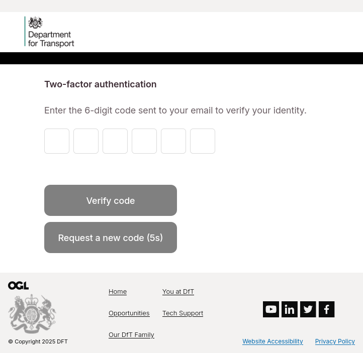

Logging into the Portal
=======================

Authenticating
**************

Once your account is created, verified, and approved by a Central Service Operator, you can sign in to the portal. Enter the email address and password you used to register, and click the login button,

.. inset::
    If your account is not yet verified, you will be sent another verification email and link. If your account is not yet approved by a Central Service Operator, you will receieve a validation message communicating this.

Two-Factor Authentication
*************************

Successful authentication navigates you to the two-factor authentication screen. An email will be sent containing your 6-digit two-factor authentication code. Enter this code in the input ang click the submit button to complete the authentication process.

