The Data Model UML Class Diagrams
=================================

This section presents UML class diagrams for the full content of the Data Model.

High-Level Full D-TRO Model
***************************

.. _high-level-dtro-objects:

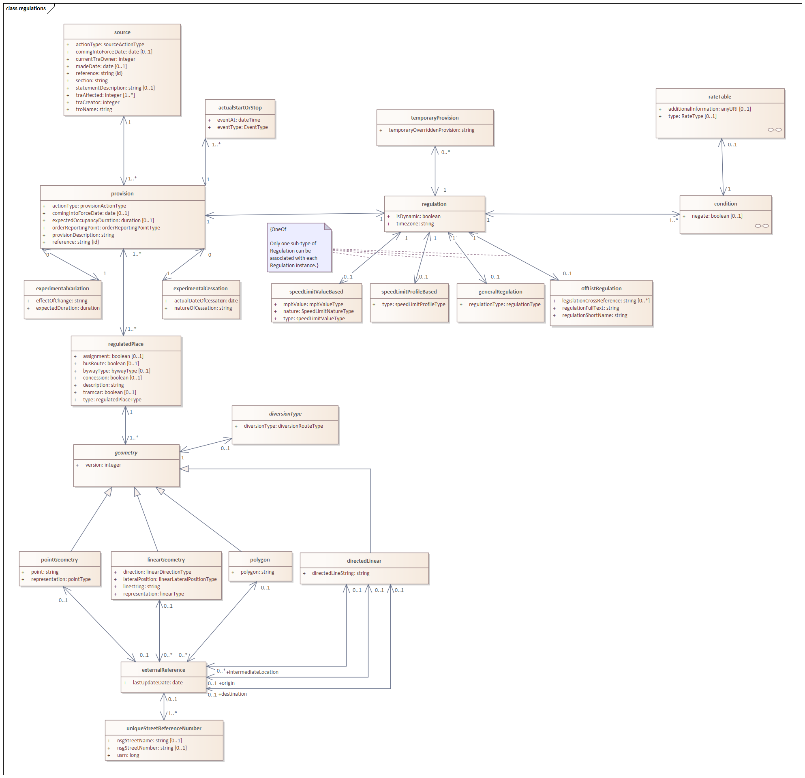

   UML class diagram - high-level full D-TRO model

``condition`` Sub-Model
***********************

.. _condition-uml:

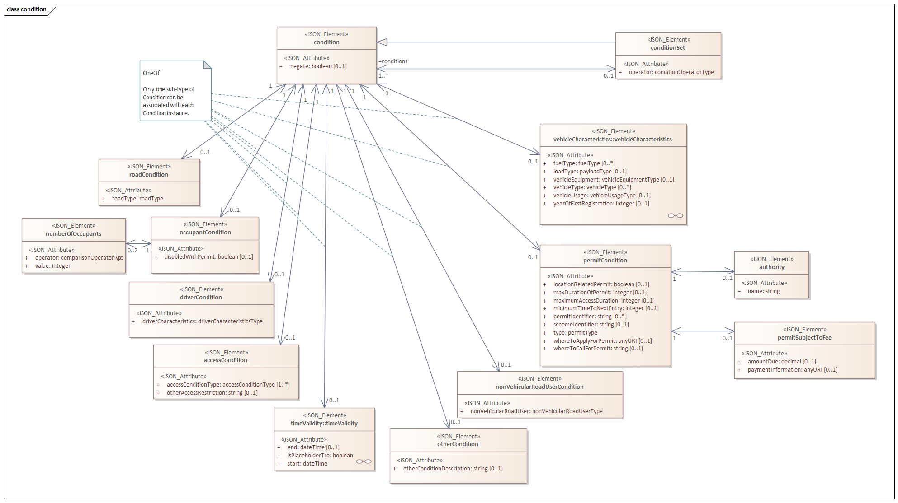

   UML class diagram - ``condition`` sub-model

``vehicleCharacteristics`` Sub-Model
************************************

.. _vehicle-characteristics-uml:

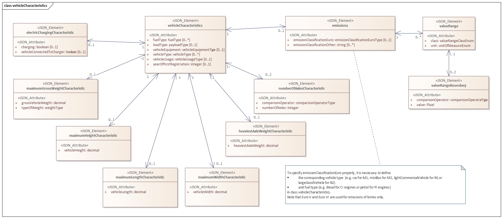

   UML class diagram - ``vehicleCharacteristics`` sub-model

``timeValidity`` Sub-Model
**************************

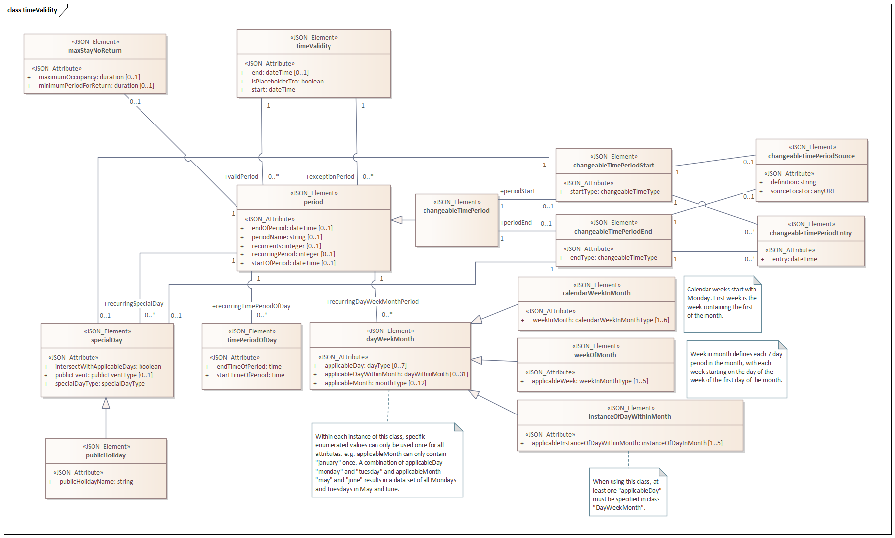

   UML class diagram - ``timeValidity`` sub-model

``rate`` Sub-Model
******************

.. _rate-uml:

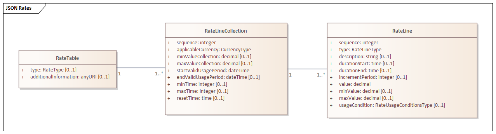

   UML class diagram - ``rate`` sub-model

``consultation`` Sub-Model
**************************

.. _consultation-uml:

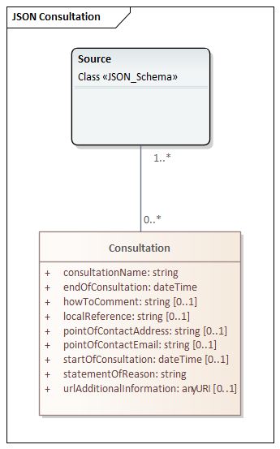

   UML class diagram - ``consultation`` sub-model

``extensionEnumeration`` Sub-Model
**********************************

This sub-model enables user-defined extensions to the main enumeration lists found in the Data Model (see ``targetEnumeratedList``). This functionality is expected to be used rarely and sparingly.

.. _extension-enumeration-uml:

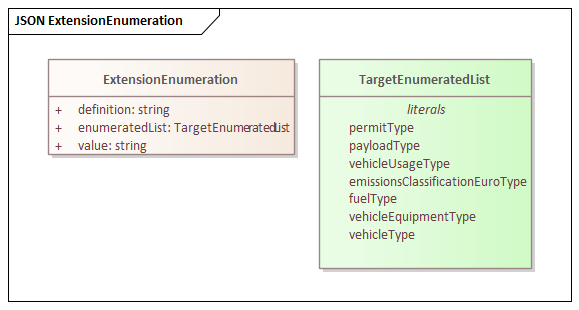

   UML class diagram - ``extensionEnumeration`` sub-model

Enumeration Classes
*******************

``regulation`` Enumerations
***************************

.. _enumerations-enums:

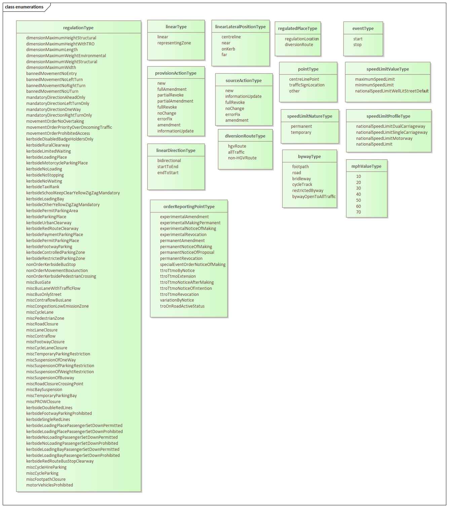

   UML class diagram - Enumeration Class in the high-level ``regulation`` sub-model

``condition`` Enumerations
**************************

.. _condition-enumerations-uml:

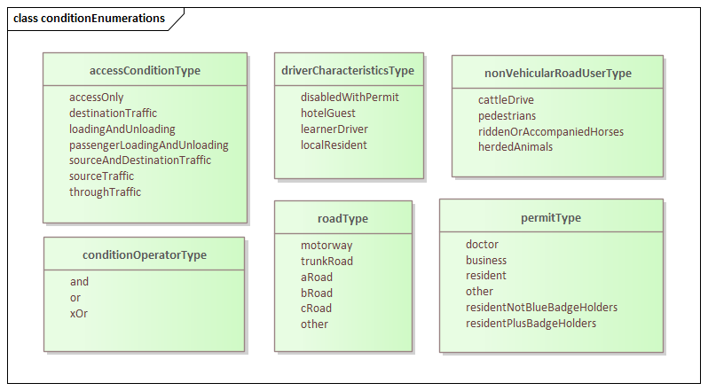

   UML class diagram - Enumeration Class in the high-level ``condition`` sub-model

``vehicleCharacteristics`` Enumerations
***************************************

.. _vehicle-characteristics-enumerations-uml:

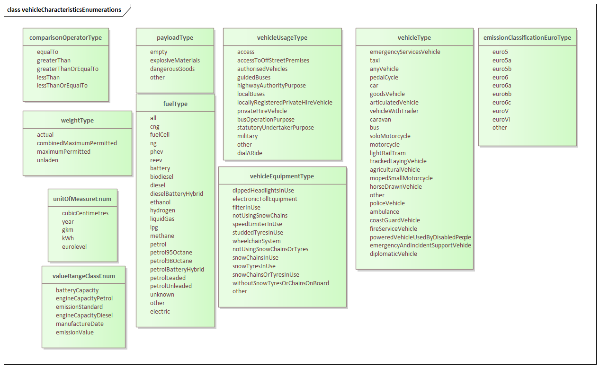

   UML class diagram - Enumeration Classes in the ``vehicleCharacteristics`` sub-model

``validity`` Enumerations
*************************

.. _validity-enumerations-uml:

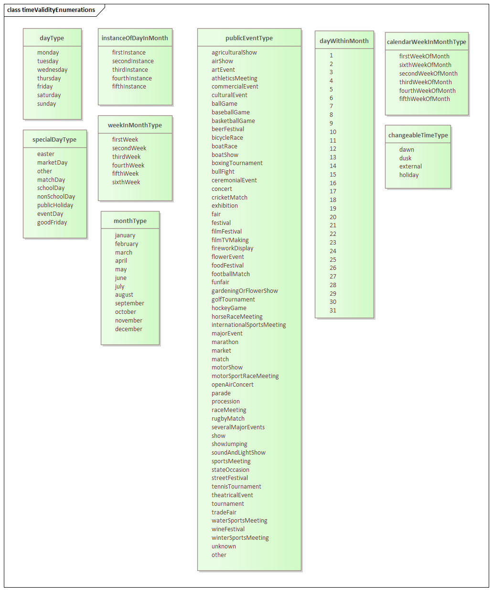

   UML class diagram - Enumeration Classes in the ``validity`` sub-model

``rate`` Enumerations
*********************

.. _rate-enumerations-uml:

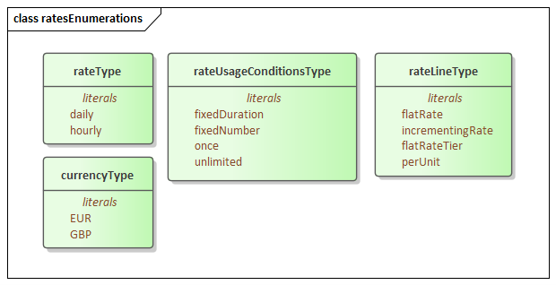

   UML class diagram - Enumeration Classes in the ``rate`` sub-model